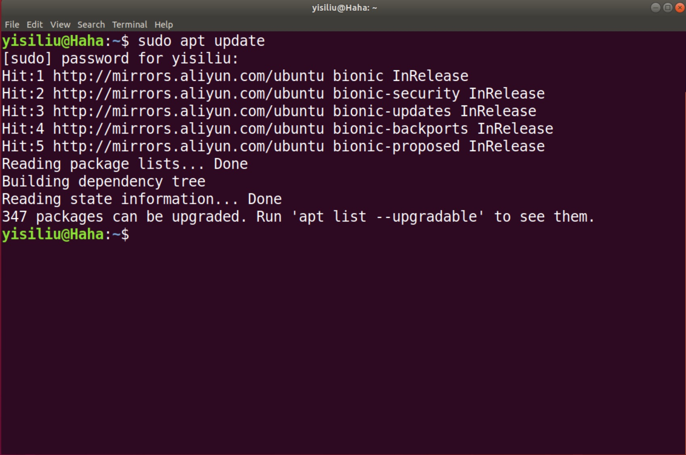
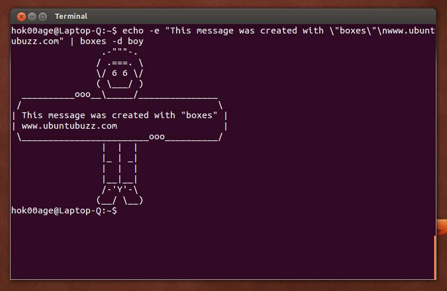

# graphproject

## 说在开始的话
原来的项目里面有一个很中二的简介，出于保护146的缘故，我就将这个简介修改了，但大多数还是来源于原来的。如果大家想看的话可以发邮箱私信我。
## 介绍
Command Line Interface (CLI)，中文翻译是命令行交互接口。这是一个在前端和后端都非常有用的工具，可以使用命令行对某些系统功能或工具进行调用。在这次项目里面将会实现一个简单的 CLI。


<center>我们用到的apt-get也是一个常用CLI</center>

---
我们本次项目的目的是用 C语言 完成一个包含图分析与算法的代码库，包括图元素的基础分析（顶点与边基础统计、图度量、边度量等）、最短路径算法等功能。再将此代码库制作成一个 CLI 工具，可以直接在 Linux 的 Terminal 里面运行。（如果你想在windows下运行可以自己按照makefile的逻辑编译代码，具体有时间我会写一个在windows下运行的指南）

## 具体要求
- 所有的源码是用C 语言实现的，只调用了 ```stdlib.h```, ```stdio.h```，```string.h```和```assert.h```。

- 在 ```stats.h``` 和 ```stats.c``` 文件中，有如下函数：
  - ```int numberOfEdges(char name[])``` 接受测试图的文件名的 ```char``` 数组，返回图中边的数量
  - ```int numberOfVertices(char name[])``` 接受测试图的文件名的 ```char``` 数组，返回图中顶点的数量
  - ```double freemanNetworkCentrality(char name[])``` 接受测试图的文件名的 ```char``` 数组，返回图中 Freeman's Network Centrality 值 所提供数据为有向图，但是在蒜这个值的时候可以当成双向连通
  - ```double betweennessCentrality(char name[], char node[])``` 接受测试图的文件名的 ```char``` 数组，返回图中 **node** 的 Betweenness Centrality 值
  - ```double closenessCentrality(char name[], char node[])``` 接受测试图的文件名的 ```char``` 数组，返回图中 **node** 的 Closeness Centrality 值
  - ```double eigenvectorCentrality(char name[], char node[])``` 接受测试图的文件名的 ```char``` 数组，返回图中 **node** 的 Eigenvector Centrality 值
  - 参考 https://www.cl.cam.ac.uk/teaching/1213/L109/stna-lecture3.pdf


- 我们将 ```DFS、BFS、Dijkstra、SPFA、A*``` 五个算法封装在 ```search.h``` 和 ```search.c``` 文件中。
  
    - 输入两个 ```int``` 值，```u``` 和 ```v```，分别为起点与终点的顶点编号
    - 输入一个 ```char``` 数组，装有所选算法的名字（分别为：```{DFS, BFS, Dijkstra, SPFA, Astar}``` ）
    - 输入一个 ```char``` 数组，装有测试图的文件名
    - 输出一个 ```int``` 数组指针，装有从 ```u``` 到 ```v``` 的最短路径


- 在 ```main.c``` 文件中，我们实现了以下功能：
  - 输出二进制文件名为 ```search-cli```
  - 利用 main 函数中的 argv 和 argc 参数接受命令行中的参数，实现了以下命令行功能：
    - ```./search-cli -h/--help```(-h或--help，以下同) 显示帮助菜单。
    - ```./search-cli -g/--graph FILE_PATH -s/--stats STATS_PARAMS``` 显示以 ```FILE_PATH``` 为输入文件的图的统计信息，具体支持的```STATS_PARAMS```参数如下：
      - ```edges``` 返回图中边的个数
      - ```vertices``` 返回图中顶点个数
      - ```freeman``` 返回图的 Freeman Centrality
      - ```betweenness -u NODE_NAME``` 返回 ```NODE_NAME``` 的 Betweenness Centrality
      - ```closeness -u NODE_NAME``` 返回 ```NODE_NAME``` 的 Closeness Centrality
      - ```eigenvector -u NODE_NAME``` 返回 ```NODE_NAME``` 的 Eigenvector Centrality
    - ```./search-cli -g/--graph FILE_PATH -sp/--shortestpath SEARCH_PARAMS -u STARTING_POINT -v TARGET_POINT``` 显示以 ```FILE_PATH``` 为输入文件的图中 从开始点 u 到 终点 v 的用 ```SEARCH_PARAMS```算出来的最短路径
      - 样例输入： ```./search-cli -g ./sx-stackoverflow.txt -sp Dijkstra -u 1 -v 5```
      - 样例输出： ```1 -> 2 -> 3 -> 4 -> 5```


- 测试文件为 ```test.txt```，检测所写算法能否在小的数据集上运行正确，具体文件格式如下：
  - 这个图的来源是一张地图，默认为无向图
  - 每一行格式： ```u v w``` 代表从```u```到```v```的权重为```w```的边
  - 正确答案保存在```test_key.txt```


- ```Makefile```
  - 目标二进制文件为： ```search-cli```


- 真正的测试集来源于[斯坦福开放的图数据集](https://snap.stanford.edu/data/amazon0601.txt.gz)
  - 同样的格式 ```u v w```，有向图
  - 具体信息参见 https://snap.stanford.edu/data/amazon0601.html


- 额外项
  -  ```./search-cli -j``` 可以在 Terminal 打印一副图画
  


- 目录结构 - 可增加新文件，此目录下所有文件是批改所需，请不要改动文件名
  ```
    GraphProject/main.c
                 search.c
                 search.h
                 stats.c
                 stats.h
                 test.txt
                 test_key.txt
                 Makefile
  ```

